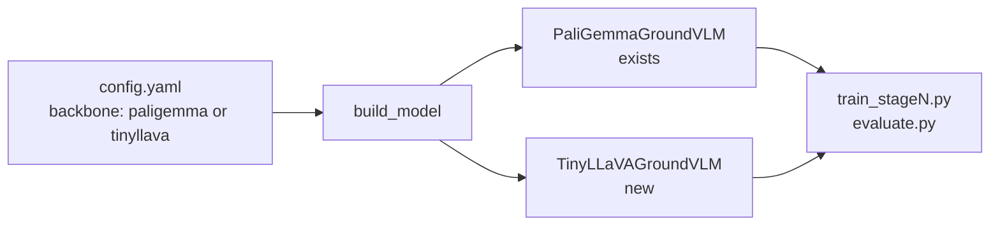

## Arquitetura alvo




Interface pública unificada (ambas as classes expõem os mesmos métodos):

- `forward(pixel_values_siglip, pixel_values_dino, input_ids, attention_mask, labels)`
- `generate(pixel_values_siglip, pixel_values_dino, input_ids, attention_mask, max_new_tokens)`
- `enable_gradient_checkpointing()`, `enable_input_require_grads()`
- propriedades `language_model`, `dino_adapter` (condicional), atributo `use_dino`

## Decisões já tomadas

1. **DINOv2+I-MoF é opcional** via flag `use_dino: bool` no config. Permite ablation entre TinyLLaVA puro vs. TinyLLaVA+DINOv2+MoF.
2. `**<loc>` tokens via texto**: `[y1,x1,y2,x2]` com coordenadas inteiras em `[0, 1000]` para PaliGemma E TinyLLaVA. Torna o Phase 4 consistente entre backbones. O módulo de métricas (`evaluation/metrics.py`) precisa aceitar os dois formatos no parser.
3. **Pesos do TinyLLaVA-1.5B são reutilizados integralmente**. Conforme o paper (Tabela A1), o checkpoint `bczhou/TinyLLaVA-1.5B` corresponde a `TinyLLaVA-share-Sig-TL` — treinado via *share recipe* em que o SFT atualiza: (a) MLP connector, (b) TinyLlama inteiro, e (c) camadas ≥12 do SigLIP. Portanto, os três componentes estão *multimodal-aligned* e devem ser carregados a partir do checkpoint, não dos repositórios base (`TinyLlama/TinyLlama-1.1B-Chat-v1.0` e `google/siglip-so400m-patch14-384`). Usar vanilla descartaria todo o alinhamento visão-linguagem já feito pelos autores.

## Componentes novos/alterados

### 1. `models/tinyllava_ground_vlm.py` (novo)

Classe `TinyLLaVAGroundVLM` análoga à `FaceGroundVLM` atual. **Todos os 3 submódulos (SigLIP, MLP, TinyLlama) recebem os pesos fine-tunados do TinyLLaVA-1.5B**:

- Instancia `SiglipVisionModel` a partir de `google/siglip-so400m-patch14-384` (arquitetura base) e imediatamente sobrescreve com `state_dict` extraído de `bczhou/TinyLLaVA-1.5B` (camadas ≥12 atualizadas pelo share recipe).
- Instancia `LlamaForCausalLM` a partir de `TinyLlama/TinyLlama-1.1B-Chat-v1.0` (arquitetura/config base) e sobrescreve com `state_dict` do TinyLlama fine-tunado no TinyLLaVA-1.5B.
- **MLP connector**: `nn.Sequential(Linear(1152, 2048), GELU(), Linear(2048, 2048))` (2-layer GELU conforme paper), carregado do checkpoint. Se `use_dino=True`, esse MLP já provê o alinhamento SigLIP→TinyLlama e reduz drasticamente o Phase 1 — pode-se até pular a pretraining do adapter DINOv2 separadamente ou reduzi-lo para poucos steps.
- **DINOv2 adapter condicional** (se `use_dino=True`): `Linear(1024, 2048)` — único componente realmente novo.
- **I-MoF condicional**: intercala tokens SigLIP (729) com DINOv2 (≈729 após resize bilinear). Sem DINOv2, usa só SigLIP (729 tokens).
- `forward` concatena `[visual_embeds | text_embeds]` e computa loss via `lm_head` apenas nas posições de texto (mesma otimização já aplicada em [models/face_ground_vlm.py](models/face_ground_vlm.py)).
- **Sem token_type_ids**: TinyLlama não usa. Atenção causal simples.

Pseudocódigo do `__init`__:

```python
self.siglip = SiglipVisionModel.from_pretrained("google/siglip-so400m-patch14-384", torch_dtype=torch.bfloat16)
self.llm = LlamaForCausalLM.from_pretrained("TinyLlama/TinyLlama-1.1B-Chat-v1.0", torch_dtype=torch.bfloat16)
self.connector = nn.Sequential(nn.Linear(1152, 2048), nn.GELU(), nn.Linear(2048, 2048))

if load_tinyllava_weights:
    ckpt = torch.load(tinyllava_weights_path)  # arquivo gerado pelo script de extração
    self.siglip.load_state_dict(ckpt["siglip"], strict=False)   # strict=False pois layers <12 não foram tocadas
    self.llm.load_state_dict(ckpt["llm"], strict=True)
    self.connector.load_state_dict(ckpt["connector"], strict=True)
```

### 2. `models/__init__.py` — Factory

```python
def build_model(cfg: dict) -> nn.Module:
    backbone = cfg.get("backbone", "paligemma")
    if backbone == "paligemma":
        from models.face_ground_vlm import FaceGroundVLM
        return FaceGroundVLM(...)
    elif backbone == "tinyllava":
        from models.tinyllava_ground_vlm import TinyLLaVAGroundVLM
        return TinyLLaVAGroundVLM(...)
    raise ValueError(f"Unknown backbone: {backbone}")
```

### 3. `models/face_ground_vlm.py` — Ajustes mínimos

- Adicionar flag `use_dino: bool = True` no `__init__` para simetria com TinyLLaVA (permite PaliGemma sem DINOv2 também, para ablation completo).
- `_encode_vision` retorna só `siglip_proj` quando `use_dino=False`.

### 4. Datasets — `data/lcs558k_dataset.py` e `data/ddvqa_dataset.py`

Datasets já são agnósticos ao modelo (recebem `processor` e `dino_transform` como dependência). Mudanças:

- Adicionar flag `backbone` para ajustar:
  - **Image size**: 448 (PaliGemma) vs. 384 (TinyLLaVA)
  - **Conversation format**: PaliGemma usa prompt direto; TinyLLaVA usa formato LLaVA-v1 (`USER: ... ASSISTANT: ...`)
  - **Tokenizer**: diferente entre backbones, passado via `processor`
- Centralizar construção do prompt no dataset usando helper `format_prompt(question, answer, backbone)`.

### 5. `training/factory.py` (novo)

Helper para construir componentes a partir do config:

```python
def build_processor_and_transforms(cfg):
    backbone = cfg.get("backbone", "paligemma")
    if backbone == "paligemma":
        processor = AutoProcessor.from_pretrained(cfg["paligemma_model"])
        tokenizer = processor.tokenizer
        image_processor = processor.image_processor
        img_size = 448
    else:  # tinyllava
        tokenizer = AutoTokenizer.from_pretrained("TinyLlama/TinyLlama-1.1B-Chat-v1.0")
        image_processor = AutoImageProcessor.from_pretrained("google/siglip-so400m-patch14-384")
        img_size = 384
    dino_transform = Compose([Resize((img_size, img_size)), ToTensor(), Normalize(...)])
    return tokenizer, image_processor, dino_transform
```

### 6. `scripts/extract_tinyllava_weights.py` (novo)

Script **obrigatório** (não mais opcional) que baixa `bczhou/TinyLLaVA-1.5B` e gera um único arquivo `outputs/tinyllava_weights.pt` contendo três sub-state_dicts:

```python
{
    "siglip":    {...},   # mapeado para nomes de SiglipVisionModel
    "connector": {...},   # mapeado para Sequential (mm_projector.0.*, mm_projector.2.*)
    "llm":       {...},   # mapeado para LlamaForCausalLM
}
```

Estratégia de carregamento:

1. Tentar `AutoModel.from_pretrained("bczhou/TinyLLaVA-1.5B", trust_remote_code=True)` e extrair os submódulos via atributos (`model.vision_tower`, `model.mm_projector`, `model.language_model` ou similar — inspecionar em runtime).
2. Se o código remoto não estiver disponível, ler `pytorch_model*.safetensors` diretamente e particionar as chaves por prefixo (`vision_tower.`, `mm_projector.`, `language_model.` / `model.`).
3. Renomear chaves para baterem com os módulos base de `transformers` (ex.: remover prefixo `vision_tower.vision_model.` se necessário).
4. Salvar `torch.save({"siglip":..., "connector":..., "llm":...}, "outputs/tinyllava_weights.pt")`.

Esse arquivo é consumido pelo `TinyLLaVAGroundVLM.__init__` e é o que garante reutilização do alinhamento multimodal já feito pelos autores do TinyLLaVA.

### 7. `training/train_stage1.py`, `train_stage2.py`, `train_stage4.py`

- Substituir `FaceGroundVLM(...)` direto por `build_model(cfg)`.
- Substituir construção manual de processor/transform por `build_processor_and_transforms(cfg)`.
- Lógica de checkpoint continua compatível (carrega `adapter` e `connector` condicionalmente).

### 8. Phase 4 (localization) — Representação textual de caixas

- `**scripts/create_loc_annotations.py**`: gerar answers com `[y1,x1,y2,x2]` textual em vez de `<loc>` tokens. Coordenadas inteiras em `[0, 1000]`. Formato consistente entre os dois backbones.
- `**evaluation/metrics.py**`: substituir `parse_loc_tokens` por `parse_bbox_text` com regex `\[(\d+),\s*(\d+),\s*(\d+),\s*(\d+)\]`. Manter `box_iou` e `compute_loc_metrics` iguais.
- **Vantagem**: elimina a necessidade de adicionar 1024 tokens ao vocabulário do TinyLlama e mantém simetria entre backbones.

### 9. Novos configs

- `configs/tinyllava_stage1_adapter.yaml` — pretraining DINOv2 adapter (só se `use_dino=True`)
- `configs/tinyllava_stage2_finetune.yaml` — LoRA no TinyLlama (target_modules: `q_proj, v_proj`)
- `configs/tinyllava_stage3_loc.yaml` — loc via texto
- `configs/tinyllava_stage4_moe.yaml` — LoRA-MoE

Cada YAML define:

```yaml
backbone: "tinyllava"
tinyllama_model: "TinyLlama/TinyLlama-1.1B-Chat-v1.0"   # arquitetura/config base
siglip_model: "google/siglip-so400m-patch14-384"        # arquitetura/config base
use_dino: true                                          # false para pure TinyLLaVA
tinyllava_weights: "outputs/tinyllava_weights.pt"       # obrigatório: pesos fine-tunados dos 3 componentes
load_tinyllava_weights: true
```

Observação sobre Phase 1 quando `backbone=tinyllava`:

- **Com `use_dino=False`**: Phase 1 é **dispensável** (MLP connector já alinhado no checkpoint). Pula-se direto para Phase 2.
- **Com `use_dino=True`**: Phase 1 treina apenas o `dino_adapter` (Linear 1024→2048); o MLP connector fica congelado porque já está alinhado. Isso reduz massivamente o custo comparado ao PaliGemma.

### 10. README + documentação

Seção "Running with TinyLLaVA backbone" com:

- Comando para baixar connector pré-treinado
- Como alternar entre backbones via config
- Tabela de trade-offs (velocidade, tokens visuais, hidden dim)

## Sequência de execução sugerida

1. **Script de extração de pesos do TinyLLaVA-1.5B (item 6)** — executar primeiro para validar que conseguimos mapear os state_dicts corretamente. Bloqueia os próximos passos.
2. Criar factory e generalizar interface (itens 1-3, 5).
3. Implementar `TinyLLaVAGroundVLM` (item 2) carregando os pesos extraídos.
4. Adaptar datasets (item 4).
5. Adaptar training scripts (item 7).
6. Substituir `<loc>` tokens por bbox textual em eval e anotações (item 8).
7. Criar configs TinyLLaVA (item 9).
8. Smoke test: forward + generate com 1 amostra para validar alinhamento visual antes de treinar.
9. Atualizar README (item 10).

## Impacto em código existente

- `models/face_ground_vlm.py`: adicionar flag `use_dino`, pequeno ajuste no `_encode_vision`.
- `models/mixture_of_features.py`: **sem mudanças** — já é agnóstico.
- `models/lora_moe.py`: **sem mudanças** — LoRA-MoE funciona identicamente em TinyLlama.
- Scripts `train_stage*.py`: substituir instanciação por factory.
- `evaluation/metrics.py`: trocar parser de `<loc>` por parser de `[y1,x1,y2,x2]`.

